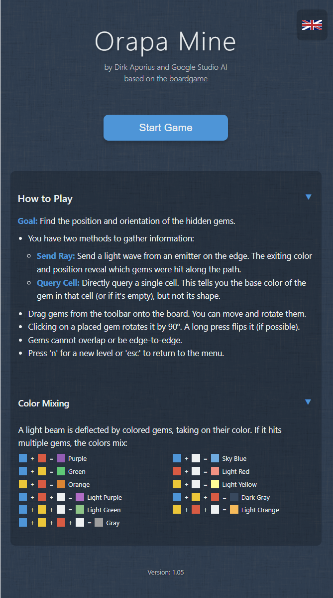
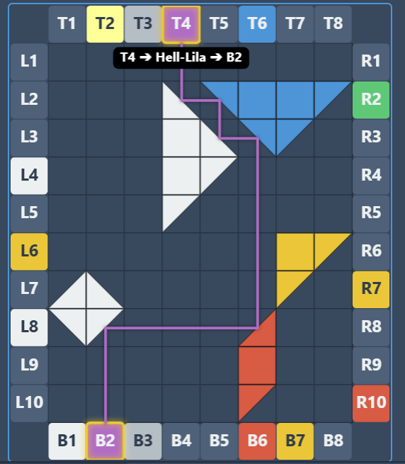
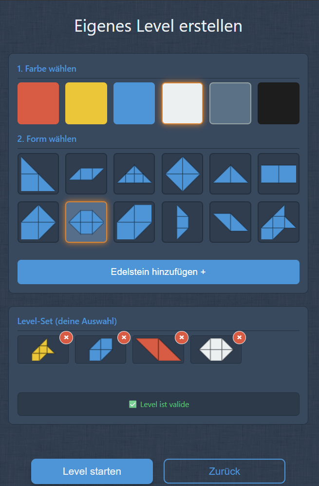

# 💎 Orapa Mine – Solo Board Game Adaptation

A **beautiful digital adaptation** of the board game [Orapa Mine](https://boardgamegeek.com/boardgame/424152/orapa-mine), designed for **solo play**.  
Enjoy the strategic challenge of gem mining, light beams, and puzzle-solving — anytime, anywhere!

Created by Dirk Aporius and Google Studio AI

---

## ✨ Features

- **Choose Your Stone Set**  
  Play with your favorite set of stones for a fresh experience every time.

- **Training Mode**  
  Visualize light beams to learn the game mechanics easily — perfect for beginners.

- **Customization**  
  Create your **own stones** and **colors** to design virtually **endless levels**.

- **Beautiful, Responsive UI**  
  Carefully crafted visuals to enhance immersion and make gameplay a joy.

---

## 🎯 Gameplay Overview

In Orapa Mine, your goal is to strategically place and arrange stones to reflect beams of light, uncover gems, and maximize your score.  
This digital adaptation captures the essence of the board game while adding features that make solo play engaging and replayable.

**Core Gameplay Loop:**
1. **Choose a stone set** or create your own.
2. **Plan your placement** — light beams will determine your success.
3. **Use training mode** to practice and refine your strategy.
4. **Aim for high scores** and create new challenges for yourself.

---

## 📸 Screenshots

| Menu | Training Mode | Custom Stones |
|----------|---------------|---------------|
|  |  |  |

---

## 🚀 Getting Started

This project contains everything you need to run the game locally.

### **Prerequisites**
- [Node.js](https://nodejs.org/) (LTS version recommended)

### **Run Locally**

```bash
# 1. Install dependencies
npm install

# 2. Run the app in development mode
npm run dev

# 3. Build for production
npm run build
